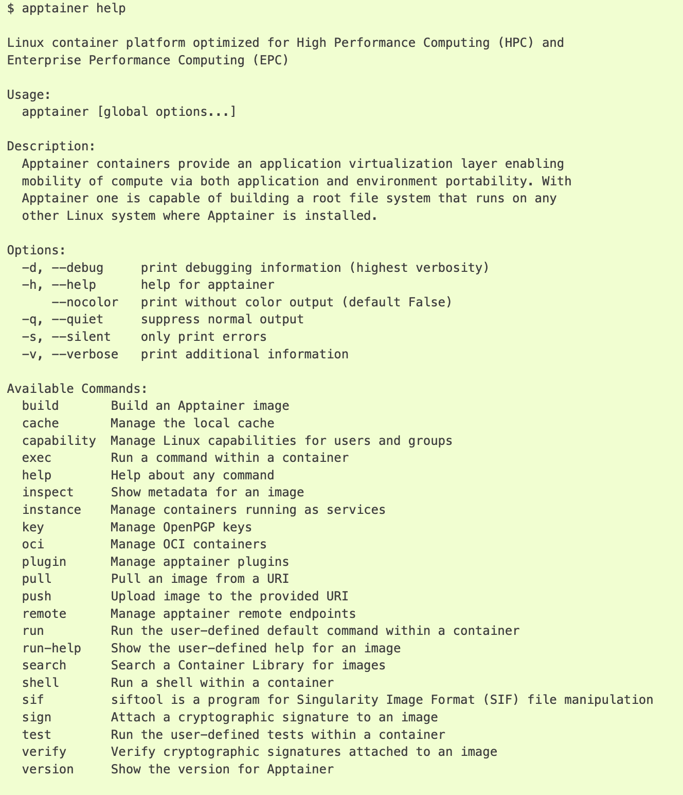
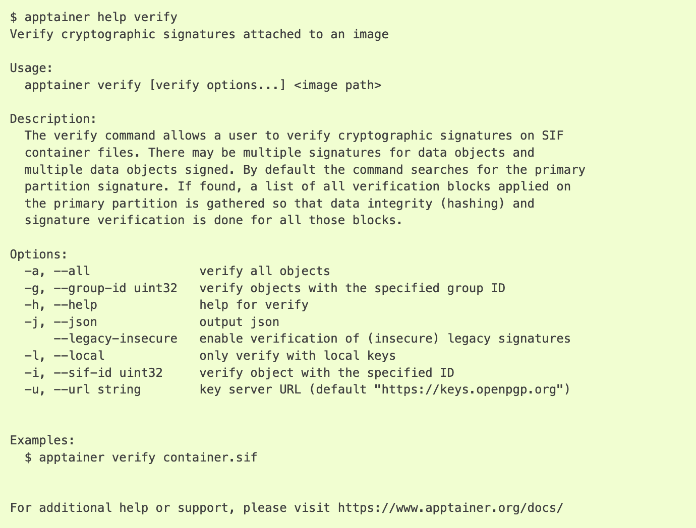

Quick start of Apptainer
^^^^^^^^^^^^^^^^^^^^^^^^^^^^^^^^^^^^^^^^^

This guide is intended for running Apptainer on Pegasus with few intended applications scenarios. Apptainer’s command line
interface : https://apptainer.org/docs/user/1.1/cli.html#cli allows you to build and interact with containers transparently. You can run programs inside a container as if they were running on your host system. You can easily redirect IO, use pipes, pass arguments, and access files, sockets, and ports on the host system from within a container.

After logging into pegasus, see availability of apptainer modules using command
"$ **module av**"  and load module to user environment $ **Module load apptainer/1.1.5** and check
"**$ module list**" whether modules are loaded to the user environment or not.

To make it persistent across sessions, edit the **vi ~/.bashrc**  file and add  **module load apptainer/version**  at last .

Overview of the Apptainer Interface
^^^^^^^^^^^^^^^^^^^^^^^^^^^^^^^^^^^^^^^^^

Verify the version of apptainer
::

     $ apptainer --version
       apptainer version 1.1.5

The help command gives an overview of Apptainer options and subcommands as follows.

::

   $ apptainer help <command> [<subcommand>]
   $ apptainer help build**
   $ apptainer help instance start

Below command Allow users to verify cryptographic signatures of container SIF (Singularity Image Format)  image files.  

Check id and OS of host application using commands  

:: 

     $id 
     $ cat  /etc/os-release 
     NAME="CentOS Linux" 
     VERSION="7 (Core)" 
     ID="centos" 
     ID_LIKE="rhel fedora" 

Use one of the following commands to interact with Singularity containers: 

* singularity shell — for an interactive shell within the container 
* singularity exec  — for executing commands within the container 
* singularity run   — for executing a pre-defined runscript within the container 

Switching OS to run specific applications
^^^^^^^^^^^^^^^^^^^^^^^^^^^^^^^^^^^^^^^^^

**Shell**

The shell command allows you to spawn a new shell within your container and interact with it as though it were a small virtual machine.shell also works with the docker://, oras://, library://, and shub:// URIs. This creates an ephemeral container that disappears when the shell is exited. 

Run  shell with a container linux version of alpine. Alpine Linux is a popular OS choice for running containers. Using a single command, we can change the OS as per application requirement. 

.. code:: bash
  
     $ apptainer shell docker://alpine 
     INFO:    Using cached SIF image 
     INFO:    squashfuse not found, will not be able to mount SIF 
     INFO:    fuse2fs not found, will not be able to mount EXT3 filesystems 
     INFO:    Converting SIF file to temporary sandbox...
     Apptainer> cat  /etc/os-release 
     NAME="Alpine Linux" 
     ID=alpine 
     VERSION_ID=3.18.2 
     PRETTY_NAME="Alpine Linux v3.18" 
     HOME_URL="https://alpinelinux.org/" 
     BUG_REPORT_URL="https://gitlab.alpinelinux.org/alpine/aports/-/issues" 

Observe the same user, file contents and uid and gid  are similar when inside the container and outside the container.  

:: 

     Apptainer> id 
     Apptainer> exit    #Exit from the container   

:: 

     $ apptainer shell docker://python 
     INFO:    Using cached SIF image 
     INFO:    squashfuse not found, will not be able to mount SIF 
     INFO:    fuse2fs not found, will not be able to mount EXT3 filesystems 
     INFO:    Converting SIF file to temporary sandbox... 
     Apptainer> python 
     Python 3.11.4 (main, Jul  4 2023, 05:25:16) [GCC 12.2.0] on linux 
     Type "help", "copyright", "credits" or "license" for more information. 
     >>> 15/3 
     5.0 
     >>> exit() 

**Executing Commands** 

The exec command allows you to execute a custom command within a container by specifying the image file. The above shell running  container is also same as running command  with container  

:: 

     $ apptainer exec docker://alpine cat /etc/os-release 

**Running a container**

run is the command you use to create a new container from an image, while  exec lets you run commands on an already running container. 
running python in container  

:: 

     $ apptainer run docker://python 

Because Apptainer run scripts are evaluated, shell scripts arguments can behave slightly differently than in Docker/OCI runtimes, if they contain shell code that may be evaluated. To replicate Docker/OCI behavior you may need additional escaping or quoting of arguments. 

:: 

     $ docker run -it --rm alpine echo "\$HOSTNAME" 
     $HOSTNAME 
     $ apptainer run docker://alpine echo "\$HOSTNAME" 
     p700 
     $ apptainer run docker://alpine echo "\\\$HOSTNAME" 
     $HOSTNAME 

**positional syntax of Apptainer**

Apptainer uses positional syntax (i.e. the order of commands and options matters). Global options affecting the behavior of all commands follow the main apptainer command. Then sub commands are followed by their options and arguments. 

For example, to pass the --debug option to the main apptainer command and run Apptainer with debugging messages on: 

For example, to pass the --debug option to the main apptainer command and run Apptainer with debugging messages on: 
:: 

     $ apptainer --debug run docker://alpine 

To pass the --containall option to the run command and run a Apptainer image in an isolated manner: 

:: 

     $ apptainer run --containall docker://alpine 
     INFO:    Using cached SIF image 
     INFO:    squashfuse not found, will not be able to mount SIF 
     INFO:    fuse2fs not found, will not be able to mount EXT3 filesystems 
     INFO:    Converting SIF file to temporary sandbox… 
     Apptainer> cat /etc/os-release 
     NAME="Alpine Linux" 
     ID=alpine 
     VERSION_ID=3.18.2 
     PRETTY_NAME="Alpine Linux v3.18" 
     HOME_URL="https://alpinelinux.org/" 
     BUG_REPORT_URL="https://gitlab.alpinelinux.org/alpine/aports/-/issues" 
     Apptainer>exit  

**Downloading images**

You can use the pull and build commands to download images from an external resource like an OCI registry. 
You can use pull with the docker:// uri to reference OCI images served from an OCI registry. In this case pull does not just download an image file. OCI images are stored in layers, so pull must also combine those layers into a usable Apptainer file. 

:: 

     $ apptainer pull docker://alpine 
     INFO:    Using cached SIF image 
     $ ls 
     Alpine_latest.sif 
     $ apptainer shell alpine_latest.sif 

You can also use the build command to download pre-built images from an external resource. When using build you must specify a name for your container like so. 

In addition to downloading images, you can use build to create images from other images or from scratch using a definition file. You can also use build to convert an image between the container formats supported by Apptainer. 

::

     $ apptainer build alpine.sif docker://alpine 
     $ apptainer shell alpine_latest.sif 
     Similarly  downloading python , $ apptainer pull docker://pyhton 