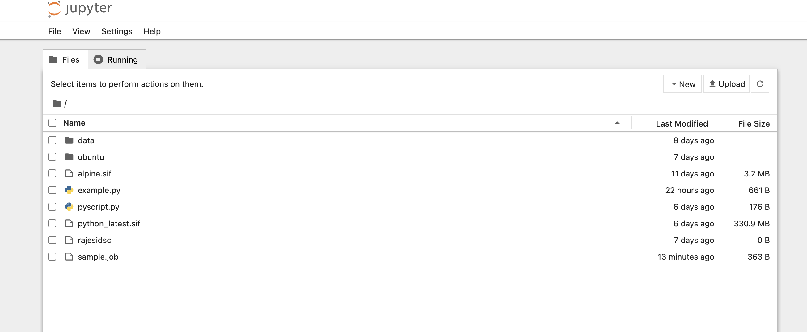

Running Apptainer container with python script
^^^^^^^^^^^^^^^^^^^^^^^^^^^^^^^^^^^^^^^^^^^^^^^^^^^

::

     $ apptainer shell python_latest.sif   # run python either using shell command 
     # or  run pyhton from the folder of sif image  
     $ ls 
     alpine.sif  data  python_latest.sif  rajesidsc  ubuntu 
     $ ./python_latest.sif 
     Python 3.11.4 (main, Jul  4 2023, 05:25:16) [GCC 12.2.0] on linux 
     Type "help", "copyright", "credits" or "license" for more information. 
     >>> 16/4 
     4.0 
     >>> exit() 

Python file is executed using container by adding some script to py file 

::

     Apptainer> $ python3 pyscript.py  

     The sum of 1.5 and 6.3 is 7.8 

Which is also same as  

::

     $ singularity run /nethome/pegasus_userid/python_latest.sif python3 pyscript.py  
     INFO:    squashfuse not found, will not be able to mount SIF 
     INFO:    fuse2fs not found, will not be able to mount EXT3 filesystems 
     INFO:    Converting SIF file to temporary sandbox... 
     The sum of 1.5 and 6.3 is 7.8 

 
**Working with Files** 

Files on the host are reachable from within the container. This example works because hostfile.txt exists in the user’s nethome directory. By default Apptainer binds mounts /nethome/$USER, /tmp, and $PWD into your container at runtime. 

::

     $ apptainer exec alpine_latest.sif cat /nethome/user/hostfile.txt  
     INFO:    squashfuse not found, will not be able to mount SIF 
     INFO:    fuse2fs not found, will not be able to mount EXT3 filesystems 
     INFO:    Converting SIF file to temporary sandbox... 
     Hello from inside the container 
     Welcome to IDSC University of miami 
     INFO:    Cleaning up image.. 

You can specify additional directories to bind mount into your container with the --bind option. In this example, the data directory on the host system is bind mounted to the /mnt directory inside the container. Pipes and redirects also work with Apptainer commands just like they do with normal Linux commands. 

::

     $ apptainer exec --bind data:/mnt alpine_latest.sif cat /mnt/hostfile.txt 
     INFO:    squashfuse not found, will not be able to mount SIF 
     INFO:    fuse2fs not found, will not be able to mount EXT3 filesystems 
     INFO:    Converting SIF file to temporary sandbox... 
     Welcome to IDSC University of miami 

 
**Build images from scratch** 

Apptainer produces immutable images in the Singularity Image File (SIF) format. This ensures reproducible and verifiable images and allows for many extra benefits such as the ability to sign and verify your containers. 

However, during testing and debugging you may want an image format that is writable. This way you can shell into the image and install software and dependencies until you are satisfied that your container will fulfill your needs. For these scenarios, Apptainer also supports the sandbox format (which is really just a directory). 

**Sandbox Directories**

To build into a sandbox (container in a directory) use the build --sandbox command and option:  It creates a directory called ubuntu/ with an entire Ubuntu Operating System and some Apptainer metadata in your current working directory. 

:: 

     $ apptainer build --sandbox ubuntu/ docker://ubuntu 
     INFO:    Starting build... 
     Getting image source signatures 
     Copying blob 3153aa388d02 done   
     Copying config 5a81c4b850 done   
     Writing manifest to image destination 
     Storing signatures 
     2023/07/17 14:40:16  info unpack layer: sha256:3153aa388d026c26a2235e1ed0163e350e451f41a8a313e1804d7e1afb857ab4 
     INFO:    Creating sandbox directory... 
     INFO:    Build complete: ubuntu/ 
     $ ls 
     alpine_latest.sif  data  python_latest.sif  ubuntu 

You can use commands like shell, exec , and run with this directory just as you would with an Apptainer image. 

 
**Persistent Overlays** 

Persistent overlay directories allow you to overlay a writable file system on an immutable read-only container for the illusion of read-write access. You can run a container and make changes, and these changes are kept separately from the base container image. 

A persistent overlay is a directory or file system image that “sits on top” of your immutable SIF container. When you install new software or create and modify files the overlay will store the changes. 

If you want to use a SIF container as though it were writable, you can create a directory, an ext3 file system image, or embed an ext3 file system image in SIF to use as a persistent overlay. Then you can specify that you want to use the directory or image as an overlay at runtime with the --overlay option, or --writable if you want to use the overlay embedded in SIF. 

If you want to make changes to the image, but do not want them to persist, use the --writable-tmpfs option. This stores all changes in an in-memory temporary filesystem which is discarded as soon as the container finishes executing. You can use persistent overlays with the following commands: run , exec , shell , instance.start.
 

**Singularity’s image cache**

If you delete a local .sif image that you have pulled from a remote image repository and then pull it again, if the image is unchanged from the version you previously pulled, you will be given a copy of the image file from your local cache rather than the image being downloaded again from the remote source. This removes unnecessary network transfers and is particularly useful for large images which may take some time to transfer over the network. How do we know what is stored in the local cache. We can remove images from the cache using the singularity cache clean command. 

::  

     $ singularity cache list 
     There are 15 container file(s) using 10.59 GiB and 153 oci blob file(s) using 11.33 GiB of space 
     Total space used: 21.93 GiB 
     $ singularity cache list -v 
     NAME                     DATE CREATED           SIZE             TYPE 
     0029e44678dea8cce45ca1   2023-07-31 08:44:50    0.46 KiB         blob 
     05ab2ba4cfe019600dcac9   2023-07-07 11:01:43    0.40 KiB         blob 
     0bdc66ab19a915c27fcb43   2023-07-26 09:45:39    6.89 KiB         blob 
     0d0dce5452b7074590ad5d   2023-08-07 12:01:55    0.75 KiB         blob 

 
We can remove images from the cache using the "$ singularity cache clean"  command 

**Namespaces:**

Namespaces are logical partitions (isolation) of container resources like user, system, network, mount similarly as development, testing, staging, production environments. Namespaces provides intelligence integration with container  

:: 

     $ man namespaces 

**fake root user inside container:** 

Initially you need to get the fake root permissions from IDSC and requested to raise the ticket with brief description of project requirement `here <https://uhealth.service-now.com/esc?id=sc_cat_item&sys_id=4080579787f1ee1099fd11383cbb3583>`_.

A “fake root” user can’t access or modify files and directories for which they don’t already have access or rights on the host filesystem, so a “fake root” user won’t be able to access root-only host files like /etc/shadow or the host /root directory. 

:: 

     $ apptainer shell --fakeroot alpine.sif  
     INFO:Converting SIF file to temporary sandbox.. 
     Apptainer> id 
     uid=0(root) gid=0(root) groups=65534(nobody) 
     Apptainer> ls -l 
     total 342117 
     -rwxr-xr-x    1 root     root       3338240 Jul 13 15:43 alpine.sif 
     drwxr-xr-x    2 root     root           512 Jul 17 13:43 data 
     -rwxr-xr-x    1 root     root     346984448 Jul 13 16:23 python_latest.sif 
     -rw-r--r--    1 root     root             0 Jul 17 15:13 rajesidsc 
     drwxr-xr-x   18 root     root          4096 Jul 17 14:40 ubuntu 
     Apptainer> exit 

 
:: 

     $ ls -l 
     total 342117 
     -rwxr-xr-x  1 apptaineruser ccsuser   3338240 Jul 13 15:43 alpine.sif 
     drwxr-xr-x  2 apptaineruser ccsuser       512 Jul 17 13:43 data 
     -rwxr-xr-x  1 apptaineruser ccsuser 346984448 Jul 13 16:23 python_latest.sif 
     -rw-r--r--  1 apptaineruser ccsuser         0 Jul 17 15:13 rajesidsc 
     drwxr-xr-x 18 apptaineruser ccsuser      4096 Jul 17 14:40 ubuntu 

 
Running GUI Jupyter notebook through Apptainer container
^^^^^^^^^^^^^^^^^^^^^^^^^^^^^^^^^^^^^^^^^^^^^^^^^^^^^^^^^^^^
see JupyterHub on Pegasus User Menu
https://acs-docs.readthedocs.io/clusters/pegasus-only/1-soft/2-data_science/Jupyterhub.html

JupyterHub on Triton User Menu
https://acs-docs.readthedocs.io/clusters/triton-only/soft/2-data_science/jh.html

Do not run Jupyter Notebook and RStudio container applications directly, as they will continue running on login nodes. This guide demonstrates the  way to run container applications on HPC systems.  These Containers should only be used for specific applications when the required software modules are not available on the HPC cluster. 

Before running any container application, please raise a ticket `here <https://uhealth.service-now.com/esc?id=sc_cat_item&sys_id=4080579787f1ee1099fd11383cbb3583>`_, based on your project requirements and we will recommend the best execution approach to run your application.

For sample running Running jupyter notebook through apptainer container without port mapping as in kubernetes  
pod configuration and click on the below kind of link to access notebook through container running on host system. 
Remember shell session will expire after closing, better to download workload sessions and files as backup. 
Any ipynb Jupyter Notebook file you will create for running applications will automatically be loaded to your Pegasus environment. 
You may also access files in your Pegasus environment to Jupyter notebook and to make it as permanent session download images through appatainer.  

::

    $ apptainer pull docker://jupyter/minimal-notebook
    INFO:    Converting OCI blobs to SIF format
    INFO:    Starting build...      # It takes time please wait
 
Run LSF interactive job for Jupyter notebook 
**previous:**  Apptainer> /opt/conda/bin/jupyter notebook --port  8888 --no-browser 

::

    $ bsub -q general -P hpc -Is apptainer run /nethome/rxp1166/minimal-notebook_latest.sif
    Job is submitted to <hpc> project.
    Job <28292518> is submitted to queue <general>.
    <<Waiting for dispatch ...>>
    <<Starting on n309>>

You will get Jupyter Server 2.7.0 is running at: http://127.0.0.1:8888/lab?token=token_id, make copy of link, replace localhost as http://pegasus.ccs.miami.edu:8888/lab?token=token_id and run in your browser. So that you can run and exec jupyter notebook applications as per needed. make sure to have data backup after running applications before termianting application. 

