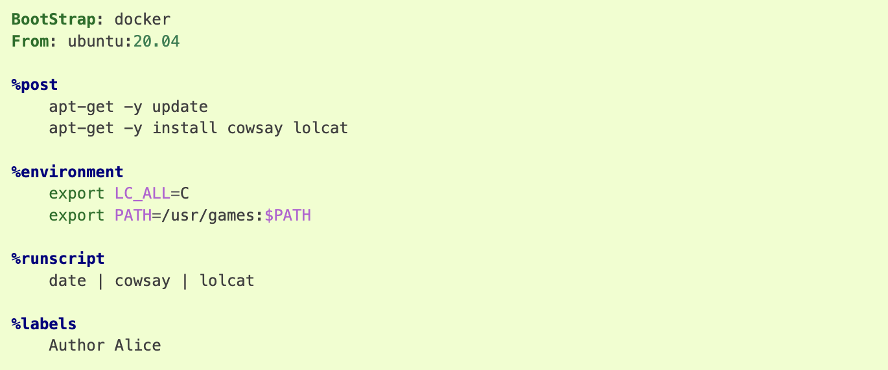

Apptainer Definition Files
^^^^^^^^^^^^^^^^^^^^^^^^^^

For a reproducible, verifiable and production-quality container you should build a SIF file using an Apptainer definition file. This also makes it easy to add files, environment variables, and install custom software. You can start with base images from Docker Hub and use images directly from official repositories such as Ubuntu, Debian, CentOS, Arch, and BusyBox. 

 

A definition file has a header and a body. The header determines the base container to begin with, and the body is further divided into sections that perform things like software installation, environment setup, and copying files into the container from the host system, etc. Here is an example of a **lolcow.def** definition file and give name of build as **lolcow.sif**

assuming it is a file named lolcow.def. To build a container from this definition file, 

::

 $ apptainer build lolcow.sif lolcow.def 

If it needed root credentials make use of –fakeroot to container to build lolcow.sif image from def file. 
Initially you need to get the fake root permissions from IDSC and requested to raise the ticket with brief description of 
project requirement `here: <https://uhealth.service-now.com/esc?id=sc_cat_item&sys_id=4080579787f1ee1099fd11383cbb3583>`_.

::

$ apptainer build --fakeroot lolcow.sif lolcow.def 

In this example, the header tells Apptainer to use a base Ubuntu 16.04 image from the default OCI registry. 

    * The %post section executes within the container at build time after the base OS has been installed. The %post section is therefore the place to perform installations of new applications. 

    * The %environment section defines some environment variables that will be available to the container at runtime. 

    * The %runscript section defines actions for the container to take when it is executed. 

    * And finally, the %labels section allows for custom metadata to be added to the container.This is a very small example of the things that you can do with a definition file. You can also use an               existing container on your host system as a base. 

For more details about def files: https://apptainer.org/docs/user/1.1/definition_files.html#definition-files 

We have changed def file in above link as rajsample.def and given name of build as raj_container.sif 

 

.. code:: bash

    Bootstrap: docker 
    From: ubuntu:18.04 
    Stage: build 
    %setup 
        touch /nethome/pegasus_usrid/file1 
        touch ${APPTAINER_ROOTFS}/file2 

    %files 
        /nethome/pegasus_userid/file1 
        /nethome/pegasus_userid/file1 /opt 

    %environment 
        export LISTEN_PORT=12345 
        export LC_ALL=C 

 
    %post 
        apt-get install -y netcat 
        NOW=`date` 
        echo "export NOW=\"${NOW}\"" >> $APPTAINER_ENVIRONMENT 

    %runscript 
        echo "Container was created $NOW" 
        echo "Arguments received: $*" 
        exec echo "$@" 

    %startscript 
        nc -lp $LISTEN_PORT 

    %test 
        grep -q NAME=\"Ubuntu\" /etc/os-release 
        if [ $? -eq 0 ]; then 
            echo "Container base is Ubuntu as expected." 
        else 
            echo "Container base is not Ubuntu." 
            exit 1 

        fi 

    %labels 
        Author alice 
        Version v0.0.1 

    %help 

        This is a demo container used to illustrate a def file that uses all supported sections. 

    

.. code:: bash

    $ apptainer build --notest raj_container.sif rajsample.def  

    INFO:    User not listed in /etc/subuid, trying root-mapped namespace 
    INFO:    fakeroot command not found 
    INFO:    Installing some packages may fail 
    INFO:    Starting build... 
    INFO:    Adding help info 
    INFO:    Adding labels 
    INFO:    Adding environment to container 
    INFO:    Adding startscript 
    INFO:    Adding runscript 
    INFO:    Adding testscript 
    INFO:    Creating SIF file... 
    INFO:    Build complete: raj_container.sif 

 

 
.. code:: bash

    $ apptainer test  raj_container.sif       # testing container 
    INFO:    Converting SIF file to temporary sandbox... 
    INFO:    underlay of /etc/localtime required more than 50 (66) bind mounts 
    Container base is Ubuntu as expected. 

 
.. code:: bash

    $./raj_container.sif Welcome to IDSC University of Maimi@!   # Running container with input text 
    Container was created Thu Jul 27 15:53:21 UTC 2023 
    Arguments received: Welcome to IDSC University of Maimi@! 
    Welcome to IDSC University of Maimi@! 

 
