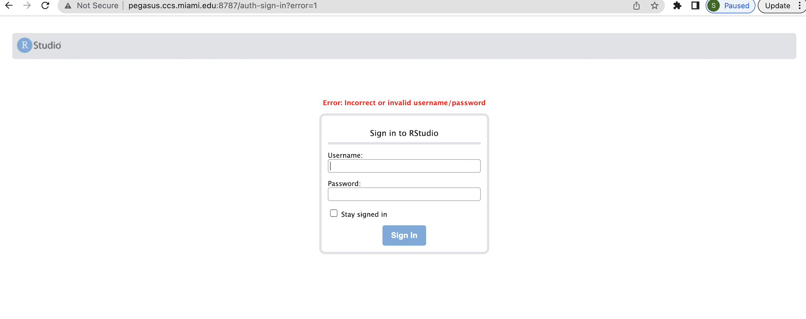
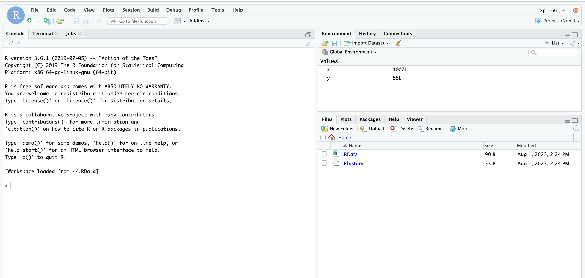

Apptainer GUI R Studio Server
^^^^^^^^^^^^^^^^^^^^^^^^^^^^^

see the link RStudio on Pegasus
https://acs-docs.readthedocs.io/pegasus/soft/RStudio.html . Do not run Jupyter Notebook and RStudio container applications directly, as they will continue running on login nodes. This guide demonstrates the  way to run container applications on HPC systems.  These Containers should only be used for specific applications when the required software modules are not available on the HPC cluster. 

Before running any container application, please raise ticket 
`here <https://uhealth.service-now.com/esc?id=sc_cat_item&sys_id=4080579787f1ee1099fd11383cbb3583>`_, 
based on your project requirements and we will recommend the best execution approach to run your application. 

To know sample Rstudio container execution Create apptainer  **tidyverse_long.def** file with environment variables of user_id and password. **export LC_ALL=C** means which support scirpts in all languages for container to run applications. Containers are read-only, but RStudio will want to be able to write configuration and temporary files in the home. Let us bind mount the current work directory as the container home. 
There’s a little caveat here, in that the actual username in the RStudio server will be rstudio if the host user has ID equal to 1000 (first user in the system), and it will instead be the same as the host $USER otherwise. Let us code these conditions as follows: 

.. code:: bash

    $ vi tidyverse_long.def  
    Bootstrap: docker 
    From: rocker/tidyverse:3.6.1 
    %environment 
        export LC_ALL=C 
        export PASSWORD=password 
        echo $USER && echo $PASSWORD 
        export R_USER=$USER && [ "$(id -u)" == "1000" ] && export R_USER=rstudio 

    %startscript 

      export R_PORT=${R_PORT:-"8787"} 
      export R_ADDRESS=${R_ADDRESS:-"0.0.0.0"} 
      rserver --www-port $R_PORT --www-address $R_ADDRESS --auth-none=0 --auth-pam-helper-path=pam-helper 

    %test 
      echo $USER && echo $PASSWORD 

    %labels 
      Author IDSC Miami University Supercomputing 
      Version 0.0.1 

Apptainer builds tidyverse_long.sif image using def file. 
Initially you need to get the fake root permissions from IDSC HPC team and request to raise the ticket with brief description of 
project requirement `here <https://uhealth.service-now.com/esc?id=sc_cat_item&sys_id=4080579787f1ee1099fd11383cbb3583>`_.

:: 

    $ apptainer build --fakeroot tidyverse_long.sif tidyverse_long.def 
    INFO:    Creating SIF file... 
    INFO:    Build complete: tidyverse_long.sif 

Instance myserver will be created by an apptainer which will bind to present working directory (pwd) to the path of /home/path. 

::

    $ singularity instance start -c -B $(pwd):/home/$R_USER tidyverse_long.sif myserver 
    INFO:    squashfuse not found, will not be able to mount SIF 
    INFO:    fuse2fs not found, will not be able to mount EXT3 filesystems 
    INFO:    Converting SIF file to temporary sandbox... 
    INFO:    instance started successfully 

::

    $ singularity instance list 
    INSTANCE NAME    PID      IP    IMAGE 
    myserver         18808          /tmp/rootfs-1436356434/root 

 

Below command shows userid and password passed as environmental varibles.  

::

    $ singularity exec instance://myserver echo $USER $PASSWORD 

 
Open the browser http://pegasus.ccs.miami.edu:8787/    enter details then you will get Apptainer GUI R Studio Server and run R applications as per need.  

::

    $ singularity instance stop myserver   # Stop R GUI server 
    INFO:    Stopping myserver instance of /tmp/rootfs-1576125237/root 
    INFO:    Killing myserver instance of /tmp/rootfs-1576125237/root  (Timeout) 

**new lsf approach:** 

::

    singularity instance stop myserver
    INFO:    Stopping myserver instance of /nethome/rxp1166/tidyverse_long.sif (PID=25267)
    INFO:    Killing myserver instance of /nethome/rxp1166/tidyverse_long.sif (PID=25267) (Timeout)
    (base) [rxp1166@login4 ~]$ bsub -q general -P hpc -Is singularity instance start -c -B $(pwd):/home/$R_USER tidyverse_long.sif             myserver
    Job is submitted to <hpc> project.
    Job <28292583> is submitted to queue <general>.
    <<Waiting for dispatch ...>>
    <<Starting on n263>>
    INFO:    instance started successfully

:: 

    bsub -q general -m n263 -P hpc -Is singularity run instance://myserver echo $USER $PASSWORD
    Job is submitted to <hpc> project.
    Job <28292585> is submitted to queue <general>.
    <<Waiting for dispatch ...>>
    <<Starting on n263>>
