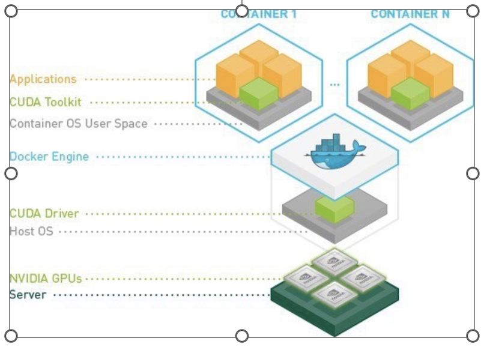

Singularity GPU Support with PyTorch and TensorFlow
^^^^^^^^^^^^^^^^^^^^^^^^^^^^^^^^^^^^^^^^^^^^^^^^^^^^^

First check GPU are accessing to your environment, if not get access permission for GPU (need to pay for use) 
and request to raise the ticket to get the GPU access with brief description of project requirement 
`here <https://uhealth.service-now.com/esc?id=sc_cat_item&sys_id=4080579787f1ee1099fd11383cbb3583>`_.

::

    $ lspci | grep VGA    
    (or) 
    $ sudo lshw -C display 
     *-display                  
    description: VGA compatible controller 
    product: G200eR2 

To access Nvidia GPU card driver installed inside of Singularity container you need to use --nv option while executing the container. To verify that you have access to the requested GPUs, run nvidia-smi inside the container: the following command takes time to build the image.  

:: 

    $ apptainer pull docker://tensorflow/tensorflow:latest-gpu 
    ... 
    INFO:    Creating SIF file... 
    INFO:    Build complete: tensorflow_latest-gpu.sif 

 

Cross check the compatibility of CUDA with TensorFlow requirements: https://www.tensorflow.org/install/source,    In my case version TensorFlow version is: 2.13.0 require s CUDA 11.8, cuDNN 8.6, Python 3.8-3.11, install modules accordingly then only it will work fine.  

CUDA and the cudatoolkit refer to the same thing. CUDA is a library used by many programs like Tensorflow and OpenCV . cudatoolkit is a set software on top of CUDA to make GPU programming easy with CUDA. You may have installed CUDA in a different path, not at the same folder where you have installed the conda. 

CUDA drivers, as shown in this image, are installed in the host running the containers (i.e. cluster node). You won't need to install the drivers in your image but you'll need to install the appropiate CUDA toolkit on it. 

**Note:** The cuda toolkit is in the container but the drivers are from the OS.  We need compatible drivers for the version of cuda used by container. 

To access the GPU inside the singularity container, we run sample LSF interactive job submission with flags. 

    * The '-q gpu_arg'  will direct to queue with nodes that have gpu 
    * The '-Is' will start interactive terminal with shell 

::

    $ bsub -q gpu_arg -P hpc -Is singularity run --nv --cleanenv tensorflow_latest-gpu.sif 
    Job is submitted to <hpc> project. 
    Job <28041843> is submitted to queue <gpu_arg>. 
    <<Waiting for dispatch ...>> 
    <<Starting on usr32>> 
    ________                               _______________ 
     ___  __/__________________________________  ____/__  /________      __ 
    __  /  _  _ \_  __ \_  ___/  __ \_  ___/_  /_   __  /_  __ \_ | /| / / 

    _  /   /  __/  / / /(__  )/ /_/ /  /   _  __/   _  / / /_/ /_ |/ |/ / 

    /_/    \___//_/ /_//____/ \____//_/    /_/      /_/  \____/____/|__/ 

    You are running this container as user with ID 4301 and group 2003, 
    which should map to the ID and group for your user on the Docker host. Great! 

nvidia-smi command. This command provides information about the NVIDIA GPUs installed on your system, including the CUDA version. This will display information about your NVIDIA GPU(s) and the CUDA version installed on your system. 

.. code:: bash

    $ apptainer> nvidia-smi 
    Fri Aug 11 04:07:59 2023        
    +-----------------------------------------------------------------------------+ 
    | NVIDIA-SMI 510.47.03    Driver Version: 510.47.03    CUDA Version: 11.6     | 
    |-------------------------------+----------------------+----------------------+ 
    | GPU  Name        Persistence-M| Bus-Id        Disp.A | Volatile Uncorr. ECC | 
    | Fan  Temp  Perf  Pwr:Usage/Cap|         Memory-Usage | GPU-Util  Compute M. | 
    |                               |                      |               MIG M. | 
    |===============================+======================+======================| 
    |   0  NVIDIA GeForce ...  Off  | 00000000:2F:00.0 Off |                  N/A | 
    | 41%   29C    P8     2W / 260W |      3MiB / 11264MiB |      0%      Default | 
    |                               |                      |                  N/A | 
    +-------------------------------+----------------------+----------------------+ 
    |   1  NVIDIA GeForce ...  Off  | 00000000:86:00.0 Off |                  N/A | 
    | 41%   36C    P8    31W / 260W |      3MiB / 11264MiB |      0%      Default | 
    |                               |                      |                  N/A | 
    +-------------------------------+----------------------+----------------------+ 

    +-----------------------------------------------------------------------------+ 
    | Processes:                                                                  | 
    |  GPU   GI   CI        PID   Type   Process name                  GPU Memory | 
    |        ID   ID                                                   Usage      | 
    |=============================================================================| 
    |  No running processes found                                                 | 
    +-----------------------------------------------------------------------------+ 

 
#Check the nvidia-cuda-toolkit version 

::

    Apptainer> uname -a 
    Linux usr32  
    Apptainer> nvcc --version 
    nvcc: NVIDIA (R) Cuda compiler driver 
    Copyright (c) 2005-2022 NVIDIA Corporation 
    Built on Wed_Sep_21_10:33:58_PDT_2022 
    Cuda compilation tools, release 11.8, V11.8.89 
    Build cuda_11.8.r11.8/compiler.31833905_0 

Apptainer experimental support is provided to use Nvidia’s nvidia-container-cli tooling for GPU container setup. This functionality, accessible via the new --nvccli flag, improves compatibility with OCI runtimes and exposes additional container configuration options. 

**NVIDIA GPUs & CUDA (Standard)**

Commands that run, or otherwise execute containers (shell, exec) can take an --nv option, which will setup the container’s environment to use an NVIDIA GPU and the basic CUDA libraries to run a CUDA enabled application. The --nv flag will: 

    * Ensure that the /dev/nvidiaX device entries are available inside the container, so that the GPU cards in the host are accessible. 

    * Locate and bind the basic CUDA libraries from the host into the container, so that they are available to the container, and match the kernel GPU driver on the host. 

    * Set the LD_LIBRARY_PATH inside the container so that the bound-in version of the CUDA libraries are used by applications run inside the container. 

**Requirements**

To use the --nv flag to run a CUDA application inside a container you must ensure that: 

    * The host has a working installation of the NVIDIA GPU driver, and a matching version of the basic NVIDIA/CUDA libraries. The host does not need to have an X server running, unless you want to run             graphical apps from the container. 
    * The NVIDIA libraries are in the system’s library search path. 
    * The application inside your container was compiled for a CUDA version, and device capability level, that is supported by the host card and driver. 

 
You can verify the GPU is available within the container by using the tensorflow **list_local_devices()** function. 

 
.. code:: bash

    Apptainer> python  
    Python 3.8.10 (default, May 26 2023, 14:05:08)  
    [GCC 9.4.0] on linux 
    Type "help", "copyright", "credits" or "license" for more information. 

    >>> from tensorflow.python.client import device_lib 
    2023-08-11 03:40:51.615500: I tensorflow/core/platform/cpu_feature_guard.cc:182] This TensorFlow binary is optimized to use available CPU instructions in performance-critical operations. 
    To enable the following instructions: AVX2 AVX512F FMA, in other operations, rebuild TensorFlow with the appropriate compiler flags. 
    
    >>> print(device_lib.list_local_devices()) 
    2023-08-11 03:41:40.858740: I tensorflow/core/common_runtime/gpu/gpu_device.cc:1639] Created device /device:GPU:0 with 9631 MB memory:  -> device: 0, name: NVIDIA GeForce RTX 2080 Ti, pci bus id:          0000:2f:00.0, compute capability: 7.5 
    2023-08-11 03:41:40.859386: I tensorflow/core/common_runtime/gpu/gpu_device.cc:1639] Created device /device:GPU:1 with 9631 MB memory:  -> device: 1, name: NVIDIA GeForce RTX 2080 Ti, pci bus id:          0000:86:00.0, compute capability: 7.5 
    [name: "/device:CPU:0" 
    device_type: "CPU" 
    memory_limit: 268435456 
    locality { 
    } 
    incarnation: 12113806794313645818 
    xla_global_id: -1 
    , name: "/device:GPU:0" 
    device_type: "GPU" 
    memory_limit: 10099425280 
    locality { 
    bus_id: 1 
    links { 
     } 
    } 
    incarnation: 5954538828647269706 
    physical_device_desc: "device: 0, name: NVIDIA GeForce RTX 2080 Ti, pci bus id: 0000:2f:00.0, compute capability: 7.5" 
    xla_global_id: 416903419 
    , name: "/device:GPU:1" 
    device_type: "GPU" 
    memory_limit: 10099425280 
    locality { 
     bus_id: 2 
    numa_node: 1 
    links { 
     } 
    } 
    incarnation: 3057053191604368287 
    physical_device_desc: "device: 1, name: NVIDIA GeForce RTX 2080 Ti, pci bus id: 0000:86:00.0, compute capability: 7.5" 
    xla_global_id: 2144165316 
    ] 

::

    >>> import tensorflow as tf 
    >>> tf.config.list_physical_devices('GPU') 
    [PhysicalDevice(name='/physical_device:GPU:0', device_type='GPU'), PhysicalDevice(name='/physical_device:GPU:1', device_type='GPU')] 
    >>>print('NumGPUsAvailable:',len(tf.config.experimental.list_physical_devices('GPU'))) 
    Num GPUs Available:  2 
    >>> print('Tensorflow version: ',tf.__version__) 
    Tensorflow version:  2.13.0 

**GPU Support with PyTorch**

Pull the latest lsf GPU image supports for PyTorch  

::

    $ singularity pull  docker://chembl/lsf-gpu:latest 

Check availibility of GPU inside sigularity and CUDA is available as true in interative LSF job script .

::

    $ bsub -q gpu_arg -P hpc -Is  "singularity run --nv --cleanenv lsf-gpu_latest.sif python -c 'import torch; print(torch.cuda.is_available()); print(torch.version.cuda)'" 
    Job is submitted to <hpc> project. 
    Job <28042682> is submitted to queue <gpu_arg>. 
    <<Waiting for dispatch ...>> 
    <<Starting on usr13>> 
    True 
    9.2.148 

LSF JOB with Singularity GPU access Script submission  
^^^^^^^^^^^^^^^^^^^^^^^^^^^^^^^^^^^^^^^^^^^^^^^^^^^^^

Create file **$ vi singularitygpu.job** with gpu access queue and make sure u have access to gpu nodes and no extra spaces at end of each line in a script file and pull the images to your environment python_latest.sif,tensorflow_latest-gpu.sif and activate your conda environment. In my case, TensorFlow version is: 2.13.0 require s CUDA 11.8,  Python 3.8-3.11, install modules accordingly then only it will work fine. See the previous example of “**Singularity GPU Support with PyTorch and TensorFlow**” before submitting job script. 

**Note:** The cuda toolkit is in the container but the drivers are from the OS.  We need compatible drivers for the version of cuda used by container. 

.. code:: bash

    $ vi singularitygpu.job
    #!/bin/bash 
    #BSUB -P hpc   
    #BSUB -J singularitygpu 
    #BSUB -o /scratch/projects/hpc/rajesh/singgpu.out  
    #BSUB -e /scratch/projects/hpc/rajesh/singgpu.err 
    #BSUB -q gpu_arg 
    #BSUB -W 1:00 
    # 
    module load anaconda3 
    module load apptainer/1.0.2 
    source /share/apps/anaconda/anaconda3_build/bin/activate 
    conda activate rajesh_env 
    export BSUB_SINGULARITY_EXEC="/share/builds/spack19/opt/spack/linux-centos7-sandybridge/gcc-11.3.0/apptainer-1.1.5-baeofwaslern4ytiqr36sfo4tl6tv327/bin/singularity" 
    export CURRENT_SINGULARITY_IMAGE="/nethome/rxp1166/python_latest.sif,/nethome/rxp1166/tensorflow_latest-gpu.sif" 
    export LSF_BIN_PATH="/share/lsf/9.1/linux2.6-glibc2.3-x86_64/bin" 
    export LSF_ETC_PATH="/share/lsf/9.1/linux2.6-glibc2.3-x86_64/etc" 
    export APPTAINER_BIND="/nethome/pegasus_id/" 
    singularity --version 
    singularity run /nethome/pegasus_id/python_latest.sif python pyscript.py 
    python pyscript.py 
    echo "LSF JOB IS RUNNING WITH IN SINGULARITY" 
    echo "LSF JOB GPU SCRIPT RUNNING with singularity" 
    singularity run --nv --cleanenv /nethome/rxp1166/tensorflow_latest-gpu.sif python3 -c "import tensorflow as tf; print('Num GPUs Available: ',len(tf.config.experimental.list_physical_devices('GPU'))); 
    print('Tensorflow version: ',tf.__version__)" 

 
submit the job 

.. code:: bash
 
    $ bsub <singularitygpu.job  
    $ cat /scratch/projects/hpc/rajesh/singgpu.out 
    ------------------------------------------------------------ 
    Successfully completed. 
    Resource usage summary: 

    CPU time :                                   22.10 sec. 
    Max Memory :                                 902 MB 
    Average Memory :                             229.50 MB 
    Total Requested Memory :                     - 
    Delta Memory :                               - 
    Max Processes :                              5 
    Max Threads :                                60 

    The output (if any) follows: 
    apptainer version 1.0.2 
    The sum of 1.5 and 6.3 is 7.8 
    The sum of 1.5 and 6.3 is 7.8 
    LSF JOB IS RUNNING WITH IN SINGULARITY 
    LSF JOB GPU SCRIPT RUNNING with singularity 
    Num GPUs Available:  2 
    Tensorflow version:  2.13.0 

