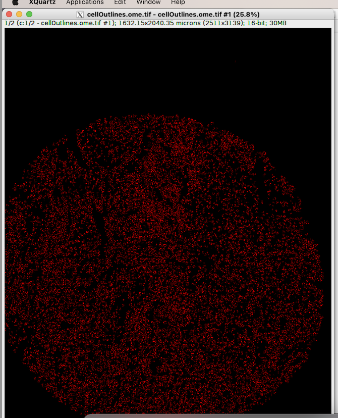
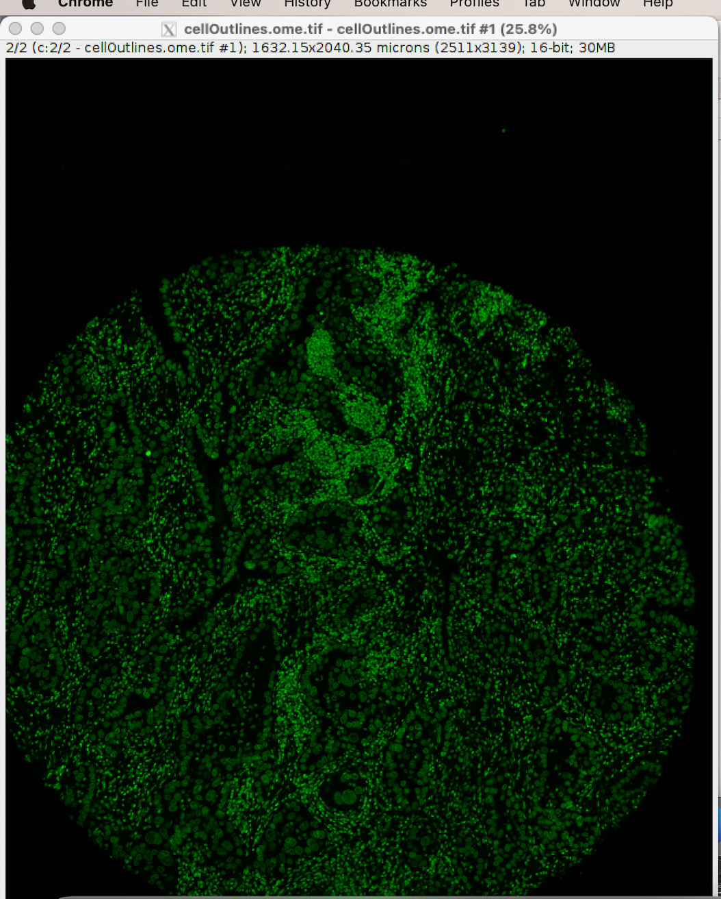

LSF Job with MCMICRO with Singularity, Nextflow
^^^^^^^^^^^^^^^^^^^^^^^^^^^^^^^^^^^^^^^^^^^^^^^^^^^^^

**Note1:** 

one important thing, by default nexflow will run application on local compute nodes where job submitted  to nodes on super computer, (means it will pull the image and store cashe files on respective nodes, it occupies more storage  on local nodes if more number of users are using it, its problem because of it is shared resources). **The best way is to run  nextflow with lsf job submission through  custom configuration pipeline.**

**Note2:**  

Do not download the MCMICRO to the login node and execute results. Module already available, just loaded it using **module load nextflow/22.10.4**   Reference of tutorial: https://mcmicro.org/tutorial/tutorial.html 

Download the example data “exemplar-001" and put in your project scratch space as /scratch/projects/hpc/rajesh/exemplar-001 from: https://mcmicro.org/how-to-use.html  and remember that  Nexflow default execution mode is local, and so it will download labsyspharm/mcmicro  to the node running application and execute the result and to avoid the local downloads on supercomputer nodes and we can create custom configuration set up to run Nextflow with LSF Job as described in next session. Nextflow  will run all the process 100% and will generate output images as new folders in the same Directory path of “/scratch/projects/hpc/rajesh/exemplar-001”. Create a job as below and ouput takes some time please wait and check bjobs command.  

.. code:: bash

    $ cat lsfmcmicro.job 
    #!/bin/bash 
    #BSUB -P hpc 
    #BSUB -J lsfmcmicrojob 
    #BSUB -o /scratch/projects/hpc/rajesh/lsfmcmicro.out 
    #BSUB -e /scratch/projects/hpc/rajesh/lsfmcmicro.err 
    #BSUB -q general 
    #BSUB -n 3 
    #BSUB -W 1:00 
    #  
    module load anaconda3 
    module load apptainer/1.0.2 
    module load nextflow/22.10.4 
    source /share/apps/anaconda/anaconda3_build/bin/activate 
    conda activate rajesh_env 
    export BSUB_SINGULARITY_EXEC="/share/builds/spack19/opt/spack/linux-centos7-sandybridge/gcc-11.3.0/apptainer-1.1.5-baeofwaslern4ytiqr36sfo4tl6tv327/bin/singularity" 
    export CURRENT_SINGULARITY_IMAGE="/nethome/rxp1166/alpine.sif, /nethome/rxp1166/python_latest.sif" 
    export LSF_BIN_PATH="/share/lsf/9.1/linux2.6-glibc2.3-x86_64/bin" 
    export LSF_ETC_PATH="/share/lsf/9.1/linux2.6-glibc2.3-x86_64/etc" 
    export APPTAINER_BIND="/scratch/projects/hpc/rajesh/" 
    singularity --version 
    echo "running LSF Job singularity with mcmciro" 
    nextflow run labsyspharm/mcmicro --in /scratch/projects/hpc/rajesh/exemplar-001 -profile singularity,lsf 
    echo "completed job" 

Output file as  

.. code:: bash
 
    $ cat lsfmcmicro.out 
    Sender: LSF System <hpc@ccs.miami.edu> 
    Subject: Job 28082472: <lsfmcmicrojob> in cluster <mk2> Done 
    Successfully completed. 
    Resource usage summary: 
    CPU time :                                   2728.60 sec. 
    Max Memory :                                 3599 MB 
    Average Memory :                             2381.72 MB 
    Total Requested Memory :                     1500.00 MB 
    Delta Memory :                               -2099.00 MB 
    Max Processes :                              20 
    Max Threads :                                126 
    The output (if any) follows: 
    apptainer version 1.0.2 
    running LSF Job singularity with mcmciro 
    N E X T F L O W  ~  version 23.04.3 
    NOTE: Your local project version looks outdated - a different revision is available in the remote repository [01c11e5615] 
    Launching `https://github.com/labsyspharm/mcmicro` [hopeful_lorenz] DSL2 - revision: 8a70201a37 [master] 
    [-        ] process > illumination                - 
    [-        ] process > registration:ashlar         - 
    [-        ] process > background:backsub          - 
    [-        ] process > dearray:coreograph          - 
    [-        ] process > dearray:roadie:runTask      - 
    [-        ] process > segmentation:roadie:runTask - 
    [-        ] process > illumination                - 
    [-        ] process > registration:ashlar         - 
    [-        ] process > background:backsub          - 
    [-        ] process > dearray:coreograph          - 
    [-        ] process > dearray:roadie:runTask      - 
    [-        ] process > segmentation:roadie:runTask - 
    [-        ] process > segmentation:worker         - 
    [-        ] process > segmentation:s3seg          - 
    [-        ] process > quantification:mcquant      - 
    [-        ] process > downstream:worker           - 
    [-        ] process > viz:autominerva             - 
    executor >  local (1) 
    [-        ] process > illumination                - 
    [e8/024fad] process > registration:ashlar         [  0%] 0 of 1 
    [-        ] process > background:backsub          - 
    [-        ] process > dearray:coreograph          - 
    [-        ] process > dearray:roadie:runTask      - 
    [-        ] process > segmentation:roadie:runTask - 
    [-        ] process > segmentation:worker         - 
    [-        ] process > segmentation:s3seg          - 
    [-        ] process > quantification:mcquant      - 
    [-        ] process > downstream:worker           - 
    [-        ] process > viz:autominerva             - 
    executor >  local (1) 
    [-        ] process > illumination                - 
    [e8/024fad] process > registration:ashlar         [  0%] 0 of 1 
    [-        ] process > background:backsub          - 
    [-        ] process > dearray:coreograph          - 
    [-        ] process > dearray:roadie:runTask      - 
    [-        ] process > segmentation:roadie:runTask - 
    [-        ] process > segmentation:worker         - 
    [-        ] process > segmentation:s3seg          - 
    [-        ] process > quantification:mcquant      - 
    [-        ] process > downstream:worker           - 
    [-        ] process > viz:autominerva             - 
    executor >  local (2) 
    [-        ] process > illumination                   - 
    [e8/024fad] process > registration:ashlar            [100%] 1 of 1 ✔ 
    [-        ] process > background:backsub             - 
    [-        ] process > dearray:coreograph             - 
    [-        ] process > dearray:roadie:runTask         - 
    [-        ] process > segmentation:roadie:runTask    - 
    [64/8aa893] process > segmentation:worker (unmics... [  0%] 0 of 1 
    [-        ] process > segmentation:s3seg             - 
    [-        ] process > quantification:mcquant         - 
    [-        ] process > downstream:worker              - 
    [-        ] process > viz:autominerva                - 
    executor >  local (2) 
    [-        ] process > illumination                   - 
    [e8/024fad] process > registration:ashlar            [100%] 1 of 1 ✔ 
    [-        ] process > background:backsub             - 
    [-        ] process > dearray:coreograph             - 
    [-        ] process > dearray:roadie:runTask         - 
    [-        ] process > segmentation:roadie:runTask    - 
    [64/8aa893] process > segmentation:worker (unmics... [  0%] 0 of 1 
    [-        ] process > segmentation:s3seg             - 
    [-        ] process > quantification:mcquant         - 
    [-        ] process > downstream:worker              - 
    [-        ] process > viz:autominerva                - 
    executor >  local (3) 
    [-        ] process > illumination                   - 
    [e8/024fad] process > registration:ashlar            [100%] 1 of 1 ✔ 
    [-        ] process > background:backsub             - 
    [-        ] process > dearray:coreograph             - 
    [-        ] process > dearray:roadie:runTask         - 
    [-        ] process > segmentation:roadie:runTask    - 
    [64/8aa893] process > segmentation:worker (unmics... [100%] 1 of 1 ✔ 
    [96/55c35d] process > segmentation:s3seg (1)         [  0%] 0 of 1 
    [-        ] process > quantification:mcquant         - 
    [-        ] process > downstream:worker              - 
    [-        ] process > viz:autominerva                - 
    executor >  local (4) 
    [-        ] process > illumination                   - 
    [e8/024fad] process > registration:ashlar            [100%] 1 of 1 ✔ 
    [-        ] process > background:backsub             - 
    [-        ] process > dearray:coreograph             - 
    [-        ] process > dearray:roadie:runTask         - 
    [-        ] process > segmentation:roadie:runTask    - 
    [64/8aa893] process > segmentation:worker (unmics... [100%] 1 of 1 ✔ 
    [96/55c35d] process > segmentation:s3seg (1)         [100%] 1 of 1 ✔ 
    [6b/a67e6b] process > quantification:mcquant (1)     [  0%] 0 of 1 
    [-        ] process > downstream:worker              - 
    [-        ] process > viz:autominerva                - 
    executor >  local (4) 
    [-        ] process > illumination                   - 
    [e8/024fad] process > registration:ashlar            [100%] 1 of 1 ✔ 
    [-        ] process > background:backsub             - 
    [-        ] process > dearray:coreograph             - 
    [-        ] process > dearray:roadie:runTask         - 
    [-        ] process > segmentation:roadie:runTask    - 
    [64/8aa893] process > segmentation:worker (unmics... [100%] 1 of 1 ✔ 
    [96/55c35d] process > segmentation:s3seg (1)         [100%] 1 of 1 ✔ 
    [6b/a67e6b] process > quantification:mcquant (1)     [  0%] 0 of 1 
    [-        ] process > downstream:worker              - 
    [-        ] process > viz:autominerva                - 
    executor >  local (4) 
    [-        ] process > illumination                   - 
    [e8/024fad] process > registration:ashlar            [100%] 1 of 1 ✔ 
    [-        ] process > background:backsub             - 
    [-        ] process > dearray:coreograph             - 
    [-        ] process > dearray:roadie:runTask         - 
    [-        ] process > segmentation:roadie:runTask    - 
    [64/8aa893] process > segmentation:worker (unmics... [100%] 1 of 1 ✔ 
    [96/55c35d] process > segmentation:s3seg (1)         [100%] 1 of 1 ✔ 
    [6b/a67e6b] process > quantification:mcquant (1)     [100%] 1 of 1 ✔ 
    [-        ] process > downstream:worker              - 
    [-        ] process > viz:autominerva                - 
    Completed at: 14-Sep-2023 17:04:35 
    Duration    : 5m 57s 
    CPU hours   : 0.1 
    Succeeded   : 4 
    completed job 

Inorder to see the ouput images install required softwares, I am using mac, make sure XQuartz is running before running Fiji  (See X11Forwarding in acs documentation: https://acs-docs.readthedocs.io/clusters/pegasus-only/1-soft/4-scientific_computing/SimVascular.html)   

::

    Logout your session and login as ssh -X username@hostname for GUI access  

To view the results using Fiji (Download Fiji based on your system requirements: https://imagej.net/software/fiji/downloads). You can use any image viewing/processing software that works for .ome.tif and .tif files.  

::

    $ cd  Fiji.app  
    $ ls 
    Contents  db.xml.gz  ImageJ2.desktop  ImageJ-linux64  images  jars  java  lib  licenses  luts  macros  plugins  README.md  retro  scripts  WELCOME.md 
    $ ./ImageJ-linux64  # Running Fiji 

 
Open image   s3seg/ in path of   “/scratch/projects/hpc/rajesh/exemplar-001”. 

    * Check that cellOutlines.ome.tif and nucleiOutlines.ome.tif show satisfactorily outlined areas 
    * cellOutlines.ome.tif found under qc/s3seg1/unmicst-exemplar-001/ can be previewed as Hyperstack in Fiji. Each cycle appears as a 2-image stack. 
    * You can split stack into individual images. **Then, choose Image>Color>Merge Channels to overlay outline with raw image for visual inspection.** 

 

Nextflow  custom configuration to run LSF Job
^^^^^^^^^^^^^^^^^^^^^^^^^^^^^^^^^^^^^^^^^^^^^^

In the Nextflow framework architecture, the executor is the component that determines the system where a pipeline process is run and supervises its execution. The executor provides an abstraction between the pipeline processes and the underlying execution system. The "profile" is the string value for the config file names in the config folder, such as "standard" for the native local environment and "Azure" for Microsoft Azure cloud computing. Two types of profiles are defined in the nextflow.config -- for defining the executor ("local", "lsf") and the execution environment ("test", "conda", "docker", "singularity"). To run the workflow in an LSF cluster, for instance, you would run Nextflow with **nextflow run -profile lsf,singularity** .

**Note:** **It is always better approach to test your application and working functionality by passing parameters as LSF inteactive job.**

Create hello.nf  for reference: https://training.seqera.io/

.. code:: bash 

    $ cat hello.nf 
    #!/usr/bin/env nextflow      
    params.greeting  = 'Hello world!'  
    greeting_ch = Channel.of(params.greeting) 
    process SPLITLETTERS {  
    input:  
        val x  
    output:  
    path 'chunk_*'  
    """  

    printf '$x' | split -b 6 - chunk_   

    """  

    }  
    process CONVERTTOUPPER {  
    input:   
        path y  
    output:  
    stdout  
    """  
    cat $y | tr '[a-z]' '[A-Z]'   

    """  

    }  
    workflow {  
    letters_ch = SPLITLETTERS(greeting_ch)  
    results_ch = CONVERTTOUPPER(letters_ch.flatten())  
    results_ch.view{ it }  

    } 

submitting LSF inteactive job and executing hello.nf using pyhton.sif 

::

    $ bsub -q general -P hpc -Is  "nextflow run /nethome/rxp1166/hello.nf -with-singularity /nethome/rxp1166/python_latest.sif" 
    Job is submitted to <hpc> project. 
    Job <28087350> is submitted to queue <general>. 
    <<Waiting for dispatch ...>> 
    <<Starting on n270>> 
    N E X T F L O W  ~  version 23.04.3 
    Launching `/nethome/rxp1166/hello.nf` [admiring_lumiere] DSL2 - revision: f306aaf9df 
    executor >  local (3) 
    [a7/64007c] process > SPLITLETTERS (1)   [100%] 1 of 1 ✔ 
    [9d/3800b1] process > CONVERTTOUPPER (2) [100%] 2 of 2 ✔ 
    HELLO  
    WORLD! 

 
submitting LSF inteactive job and executing hello.nf using pyhton.sif with profile computation sanger and LSF. Specifying -profile sanger,lsf will instruct Nextflow to run tasks as separate LSF jobs in parallel and will instruct the pipeline to build a local Singularity image from the quay.io Docker image. 

:: 

    $ bsub -q general -P hpc -Is  "nextflow run /nethome/rxp1166/hello.nf -with-singularity /nethome/rxp1166/python_latest.sif -profile sanger,lsf" 
    Job is submitted to <hpc> project. 
    Job <28087351> is submitted to queue <general>. 
    <<Waiting for dispatch ...>> 
    <<Starting on n302>> 
    N E X T F L O W  ~  version 23.04.3 
    Launching `/nethome/rxp1166/hello.nf` [nice_stallman] DSL2 - revision: f306aaf9df 
    executor >  local (3) 
    [e4/da17e7] process > SPLITLETTERS (1)   [100%] 1 of 1 ✔ 
    [b4/ed010d] process > CONVERTTOUPPER (2) [100%] 2 of 2 ✔ 
    HELLO  
    WORLD! 

  
submitting LSF inteactive job and executing hello.nf using pyhton.sif with profile computation singularity container and LSF (it works after module load singularity )
 
::

    $ bsub -q general -P hpc -Is  "nextflow run /nethome/rxp1166/hello.nf -with-singularity /nethome/rxp1166/python_latest.sif -profile singularity,lsf" 
    Job is submitted to <hpc> project. 
    Job <28087354> is submitted to queue <general>. 
    <<Waiting for dispatch ...>> 
    <<Starting on n255>> 
    N E X T F L O W  ~  version 23.04.3 
    Launching `/nethome/rxp1166/hello.nf` [nostalgic_woese] DSL2 - revision: f306aaf9df 
    executor >  local (3) 
    [37/c2c937] process > SPLITLETTERS (1)   [100%] 1 of 1 ✔ 
    [81/a59ca6] process > CONVERTTOUPPER (1) [100%] 2 of 2 ✔ 
    WORLD! 
    HELLO 

We need to keep capital p in cluster options for Project -P and remove grid job after process and need to include executor, profile and process in configuration file and i have two process splitter and convertor. one of advantage of nextflow is job will automatically convert to the required script of lsf , slurm, sge by changing one parameter in config file  like   

::

    process.executor = 'LSF' 

::

    # General information queueSize in config file      
    Queue size = the packet buffer for 1 device before it starts dropping packets 
    Total Queue Size = the total amount of devices it will buffer before its starts dropping packets. 
    4000kb/100kb = 40 devices 
    # see some sample config files  
    https://github.com/nf-core/configs/tree/master/conf 
    https://github.com/nf-core/tools#installation 

Sample Nextflow Configuration  

.. code:: bash

    $ vi raj1.config  
    params { 
        config_profile_description = 'rajesh sample profile execution.' 
        config_profile_contact = 'Rajesh' 
    } 
    executor { 
        name = 'lsf' 
        perTaskReserve = false 
        perJobMemLimit = true 
        queueSize = 100 
        submitRateLimit = '5 sec' 
    } 
    profiles { 
        lsf { 
            process.executor = 'LSF' 
            process.queue = 'general' 
            process.cache = 'lenient' 
            process.clusterOptions = '-P hpc' 
            } 
    } 
    singularity { 
        enabled = true 
        autoMounts = true 
    } 
    process { 
        executor = 'lsf' 
        queue = 'general' 
        clusterOptions = '-P hpc' 
        cpus = 8 
        time = '2.h' 
        memory = '8.GB' 
        withName: 'SPLITLETTERS|CONVERTTOUPPER' { 
        cpus = 4 
        memory = '4.GB' 
        } 
    } 

    params { 
        max_memory = '15.GB' 
        max_cpus = 25 
        max_time = '2.h' 
    } 

 
Running Nextflow Configuration file  

:: 

    $ nextflow run /nethome/rxp1166/hello.nf -c '/nethome/rxp1166/raj1.config' 
    N E X T F L O W  ~  version 23.04.3 
    Launching `/nethome/rxp1166/hello.nf` [tiny_dijkstra] DSL2 - revision: f306aaf9df 
    executor >  lsf (3) 
    [52/662484] process > SPLITLETTERS (1)   [100%] 1 of 1 ✔ 
    [85/76c420] process > CONVERTTOUPPER (1) [100%] 2 of 2 ✔ 
    WORLD! 
    HELLO 

 
Verifying the Nextflow is running the Job through LSF  

.. code:: bash

    bhist -l 28095958  #JOB ID  
    Job <28095958>, Job Name <nf-SPLITLETTERS_(1)>, User <rxp1166>, Project <hpc>,  
    Command 

 
nf-core Module for Nextflow  
^^^^^^^^^^^^^^^^^^^^^^^^^^^

nf-core,  it will maintain all nextflow pipelines easily and supports for custom config files as per DSL2 (Domain specific Language) 
After activation of any conda environment having python version

::

    $conda env list
    $ conda activate rajesh_env
    $ pip install nf-core    # wait for installation completion  

**Checking all nf-core pipelines** 

::

    $  nf-core list  

    nf-core list
                                          ,--./,-.
          ___     __   __   __   ___     /,-._.--~\
    |\ | |__  __ /  ` /  \ |__) |__         }  {
    | \| |       \__, \__/ |  \ |___     \`-._,-`-,
                                          `._,._,'
    nf-core/tools version 2.9 - https://nf-co.re
    There is a new version of nf-core/tools available! (2.10)

    ┏━━━━━━━━━━━━━━━━━━━━━━━━┳━━━━━━━┳━━━━━━━━━━━━━━━━┳━━━━━━━━━━━━━━━┳━━━━━━━━━━━━━┳━━━━━━━━━━━━━━━━━━━━━━┓
    ┃ Pipeline Name          ┃ Stars ┃ Latest Release ┃      Released ┃ Last Pulled ┃ Have latest release? ┃
    ┡━━━━━━━━━━━━━━━━━━━━━━━━╇━━━━━━━╇━━━━━━━━━━━━━━━━╇━━━━━━━━━━━━━━━╇━━━━━━━━━━━━━╇━━━━━━━━━━━━━━━━━━━━━━┩
    │ pixelator              │     1 │            dev │  24 hours ago │           - │ -                    │
    │ pangenome              │    33 │            dev │     yesterday │           - │ -                    │
    │ taxprofiler            │    66 │            dev │     yesterday │           - │ -                    │
    │ rnavar                 │    20 │            dev │     yesterday │           - │ -                    │
    │ rnaseq                 │   670 │            dev │     yesterday │           - │ -                    │
    │ epitopeprediction      │    25 │            dev │     yesterday │           - │ -                    │
    │ bacass                 │    46 │            dev │     yesterday │           - │ -                    │
    │ sarek                  │   276 │            dev │    2 days ago │           - │ -                    │
    │ metatdenovo            │     3 │            dev │    2 days ago │           - │ -                    │
    │ mag                    │   145 │            dev │    2 days ago │           - │ -                    │
    │ differentialabundance  │    27 │            dev │    3 days ago │           - │ -                    │
    │ readsimulator          │     0 │            dev │    3 days ago │           - │ -                    │
    │ mhcquant               │    27 │            dev │    3 days ago │           - │ -                    │
    │ rnasplice              │     9 │            dev │    4 days ago │           - │ -                    │
    │ metaboigniter          │    11 │            dev │    4 days ago │           - │ -                    │
    │ rnadnavar              │     0 │            dev │    4 days ago │           - │ -                    │
    │ dualrnaseq             │    13 │            dev │    4 days ago │           - │ -                    │
    │ fetchngs               │    87 │            dev │    4 days ago │           - │ -                    │
    │ phageannotator         │     4 │            dev │    6 days ago │           - │ -                    │
    │ bamtofastq             │    10 │            dev │    6 days ago │           - │ -                    │
    │ sammyseq               │     0 │            dev │    6 days ago │           - │ -                    │
    │ eager                  │   103 │            dev │    1 week ago │           - │ -                    │
    │ funcscan               │    43 │            dev │   1 weeks ago │           - │ -                    │
    │ nascent                │    10 │            dev │   1 weeks ago │           - │ -                    │
    │ raredisease            │    59 │            dev │   1 weeks ago │           - │ -                    │
    │ proteinfold            │    27 │            dev │   1 weeks ago │           - │ -                    │
    │ rnafusion              │   114 │            dev │   1 weeks ago │           - │ -                    │
    │ scrnaseq               │   102 │            dev │   1 weeks ago │           - │ -                    │
    │ circrna                │    31 │            dev │   2 weeks ago │           - │ -                    │
    │ multiplesequencealign  │     4 │            dev │   2 weeks ago │           - │ -                    │
    │ ampliseq               │   131 │            dev │   2 weeks ago │           - │ -                    │
    │ crisprseq              │    11 │            dev │   2 weeks ago │           - │ -                    │
    │ mcmicro                │     0 │            dev │   2 weeks ago │           - │ -                    │
    │ chipseq                │   153 │            dev │   2 weeks ago │           - │ -                    │
    │ atacseq                │   148 │            dev │   2 weeks ago │           - │ -                    │
    │ molkart                │     2 │            dev │   2 weeks ago │           - │ -                    │
    │ metapep                │     4 │            dev │   2 weeks ago │           - │ -                    │
    │ methylseq              │   117 │            dev │   3 weeks ago │           - │ -                    │
    │ viralrecon             │   101 │            dev │   3 weeks ago │           - │ -                    │
    │ pathogensurveillance   │     6 │            dev │  1 months ago │           - │ -                    │
    │ createpanelrefs        │     3 │            dev │  1 months ago │           - │ -                    │
    │ quantms                │    14 │            dev │  1 months ago │           - │ -                    │
    │ smrnaseq               │    58 │            dev │  1 months ago │           - │ -                    │
    │ nanostring             │     6 │            dev │  1 months ago │           - │ -                    │
    │ cutandrun              │    51 │            dev │  1 months ago │           - │ -                    │
    │ demultiplex            │    28 │            dev │  2 months ago │ 1 weeks ago │ No (v1.3.2)          │
    │ isoseq                 │    16 │            dev │  2 months ago │           - │ -                    │
    │ airrflow               │    32 │            dev │  3 months ago │           - │ -                    │
    │ viralintegration       │    11 │            dev │  3 months ago │           - │ -                    │
    │ hicar                  │     4 │            dev │  3 months ago │           - │ -                    │
    │ circdna                │    17 │            dev │  3 months ago │           - │ -                    │
    │ marsseq                │     4 │            dev │  3 months ago │           - │ -                    │
    │ spatialtranscriptomics │    28 │            dev │  3 months ago │           - │ -                    │
    │ hic                    │    60 │            dev │  4 months ago │           - │ -                    │
    │ nanoseq                │   123 │            dev │  5 months ago │           - │ -                    │
    │ callingcards           │     2 │            dev │  5 months ago │           - │ -                    │
    │ gwas                   │    15 │            dev │  5 months ago │           - │ -                    │
    │ hgtseq                 │    18 │            dev │  5 months ago │           - │ -                    │
    │ genomeassembler        │    13 │            dev │  5 months ago │           - │ -                    │
    │ spinningjenny          │     0 │            dev │  7 months ago │           - │ -                    │
    │ variantcatalogue       │     4 │            dev │  7 months ago │           - │ -                    │
    │ phyloplace             │     3 │            dev │  7 months ago │           - │ -                    │
    │ clipseq                │    16 │            dev │  7 months ago │           - │ -                    │
    │ radseq                 │     3 │            dev │  8 months ago │           - │ -                    │
    │ hlatyping              │    47 │            dev │  9 months ago │           - │ -                    │
    │ fastquorum             │     8 │            dev │ 11 months ago │           - │ -                    │
    │ coproid                │     8 │            dev │ 11 months ago │           - │ -                    │
    │ lncpipe                │    26 │            dev │   1 years ago │           - │ -                    │
    │ imcyto                 │    23 │            dev │   1 years ago │           - │ -                    │
    │ mnaseseq               │    10 │            dev │   1 years ago │           - │ -                    │
    │ genomeannotator        │    12 │            dev │   2 years ago │           - │ -                    │
    │ proteomicslfq          │    32 │            dev │   2 years ago │           - │ -                    │
    │ cageseq                │     9 │            dev │   2 years ago │           - │ -                    │
    │ scflow                 │    21 │            dev │   2 years ago │           - │ -                    │
    │ bactmap                │    45 │            dev │   2 years ago │           - │ -                    │
    │ diaproteomics          │    12 │            dev │   2 years ago │           - │ -                    │
    │ pgdb                   │     5 │            dev │   2 years ago │           - │ -                    │
    │ slamseq                │     4 │            dev │   2 years ago │           - │ -                    │
    └────────────────────────┴───────┴────────────────┴───────────────┴─────────────┴──────────────────────┘

checking all configuration files for user pipline and maintain orginal copy of user pipeline nexflow.config and change it as per application needs is always good approach. 

::

    $ nf-core create    # It will asks for pipeline name  and Enter details 

    rajsamplepipeline  
    ..............
    $ cd nf-core-rajeshsamplepipline/ 
    (rajesh_env) $ tree 

::

    ├── assets 
    │   ├── adaptivecard.json 
    │   ├── email_template.html 
    │   ├── email_template.txt 
    │   ├── methods_description_template.yml 
    │   ├── multiqc_config.yml 
    │   ├── nf-core-rajeshsamplepipline_logo_light.png 
    │   ├── samplesheet.csv 
    │   ├── schema_input.json 
    │   ├── sendmail_template.txt 
    │   └── slackreport.json 
    ├── bin 
    │   └── check_samplesheet.py 
    ├── CHANGELOG.md 
    ├── CITATIONS.md 
    ├── CODE_OF_CONDUCT.md 
    ├── conf 
    │   ├── base.config 
    │   ├── igenomes.config 
    │   ├── modules.config 
    │   ├── test.config 
    │   └── test_full.config 
    ├── cpnextflow.config 
    ├── docs 
    │   ├── images 
    │   │   ├── mqc_fastqc_adapter.png 
    │   │   ├── mqc_fastqc_counts.png 
    │   │   ├── mqc_fastqc_quality.png 
    │   │   ├── nf-core-rajeshsamplepipline_logo_dark.png 
    │   │   └── nf-core-rajeshsamplepipline_logo_light.png 
    │   ├── output.md 
    │   ├── README.md 
    │   └── usage.md 
    ├── lib 
    │   ├── nfcore_external_java_deps.jar 
    │   ├── NfcoreTemplate.groovy 
    │   ├── Utils.groovy 
    │   ├── WorkflowMain.groovy 
    │   └── WorkflowRajeshsamplepipline.groovy 
    ├── LICENSE 
    ├── main.nf 
    ├── modules 
    │   ├── local 
    │   │   └── samplesheet_check.nf 
    │   └── nf-core 
    │       ├── custom 
    │       │   └── dumpsoftwareversions 
    │       │       ├── main.nf 
    │       │       ├── meta.yml 
    │       │       └── templates 
    │       │           └── dumpsoftwareversions.py 
    │       ├── fastqc 
    │       │   ├── main.nf 
    │       │   └── meta.yml 
    │       └── multiqc 
    │           ├── main.nf 
    │           └── meta.yml 
    ├── modules.json 
    ├── **nextflow.config**
    ├── nextflow_schema.json 
    ├── pyproject.toml 
    ├── README.md 
    ├── subworkflows 
    │   └── local 
    │       └── input_check.nf 
    ├── tower.yml 
    └── workflows 
        └── **rajeshsamplepipline.nf**
    17 directories, 51 files 

