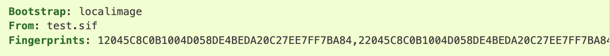

SIF Image Verification / Fingerprints Header
^^^^^^^^^^^^^^^^^^^^^^^^^^^^^^^^^^^^^^^^^^^^

If the bootstrap image is in the SIF format, then verification will be performed at build time. This verification checks whether the image has been signed. If it has been signed the integrity of the image is checked, and the signatures matched to public keys if available. This process is equivalent to running **apptainer verify** on the bootstrap image. 

By default a failed verification, e.g. against an unsigned image, or one that has been modified after signing, will produce a warning but the build will continue.To enforce that the bootstrap image verifies correctly and has been signed by one or more keys, you can use the **Fingerprints:** header. 

If, at build time, the image is not signed with keys corresponding to all of the listed fingerprints, the build will fail. 

    * The **Fingerprints:** header can be used with bootstrap agents that provide a SIF image.
    * The **library** agent always retrieves a SIF image. 
    * The **local image** agent can be used to refer to SIF or other types of images. 
    * The **Fingerprints:** header has no effect if the bootstrap image is not in SIF format. 

Signing and Verifying Containers(Container image security)
^^^^^^^^^^^^^^^^^^^^^^^^^^^^^^^^^^^^^^^^^^^^^^^^^^^^^^^^^^

Apptainer has the ability to create and manage PGP keys and use them to sign and verify containers. This provides a trusted method for Apptainer users to share containers. It ensures a bit-for-bit reproduction of the original container as the author intended it. This sections will answer the following two questions first one is how do you verify the containers when downloading images from untrusted sources using cryptographically signing and how do you run the containers in untrusted environments by encrypting using RSA public keys, so that nobody knows nothing what is running inside the container. Second use case is not necessary right now, so providing a case study for the first scenario.  

To sign your own containers you first need to generate one or more keys. 

::

    $ apptainer key newpair 
    Enter your name (e.g., John Doe) : rajesh 
    Enter your email address (e.g., john.doe@example.com) :  
    Enter optional comment (e.g., development keys) :   
    Enter a passphrase :  
    Retype your passphrase :  
    Generating Entity and OpenPGP Key Pair... done 

The **list** subcommand will show you all of the keys you have created or saved locally.

::

    $ apptainer key list 
    Public key listing : 
    0) U: rajesh () <> 
    C: 2023-07-18 14:39:11 -0400 EDT 
    F: ########
    L: ###### 
    -------- 

In the output above the index of my key is 0 and the letters stand for the following: 

U: User 

C: Creation date and time 

F: Fingerprint 

L: Key length 

Now that you have a key generated, you can use it to sign images: 

::

    $ apptainer sign python_latest.sif 
    Signing image: python_latest.sif 
    Signature created and applied to python_latest.sif 

Because your public PGP key is saved locally you can verify the image without needing to contact the key server 

::

    $ apptainer verify python_latest.sif  
    Verifying image: python_latest.sif 
    [LOCAL]   Signing entity: rajesh 
    [LOCAL]   Fingerprint: ########## 
    Objects verified: 
    ID  |GROUP   |LINK    |TYPE 
    ------------------------------------------------ 
    1   |1       |NONE    |Def.FILE 
    2   |1       |NONE    |JSON.Generic 
    3   |1       |NONE    |JSON.Generic 
    4   |1       |NONE    |FS 
    Container verified: python_latest.sif 

SIF IDs and Groups
^^^^^^^^^^^^^^^^^^^^^
As well as the default behaviour, which signs all objects, fine-grained control of signing is possible. 

sif list a SIF file you will see it is comprised of a number of objects. Each object has an ID, and belongs to a GROUP. 

::

    $ apptainer sif list python_latest.sif  
    ------------------------------------------------------------------------------ 
    ID   |GROUP   |LINK    |SIF POSITION (start-end)  |TYPE 
    ------------------------------------------------------------------------------ 
    1    |1       |NONE    |32176-32208               |Def.FILE 
    2    |1       |NONE    |32208-36744               |JSON.Generic 
    3    |1       |NONE    |36744-37212               |JSON.Generic 
    4    |1       |NONE    |40960-346984448           |FS (Squashfs/*System/amd64) 
    5    |NONE    |1   (G) |346984448-346986245       |Signature (SHA-256)  

we can choose to sign and verify a specific object with the --sif-id option to sign and verify 

::

    $ apptainer verify --sif-id 2 python_latest.sif  
    Verifying image: python_latest.sif 
    [LOCAL]   Signing entity: rajesh 
    [LOCAL]   Fingerprint: #######################
    Objects verified: 
    ID  |GROUP   |LINK    |TYPE 
    ------------------------------------------------ 
    2   |1       |NONE    |JSON.Generic 
    Container verified: python_latest.sif 

 

This QuickStart document describes the surface of all of the things you can do with Apptainer! For additional help or support, please visit: https://www.apptainer.org/docs/ .  
If you need additional help or support, see: https://apptainer.org/help and contact HPC Team IDSC University of Miami or Raise Ticket with brief description of project requirement to hpc@ccs.miami.edu 

 

  
 

 

