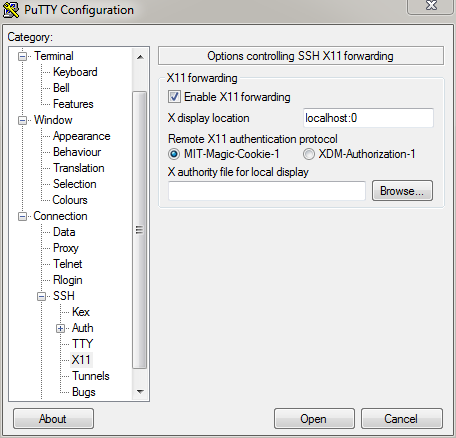

.. _ssh:

========================================
Connecting to Advanced Computing Systems 
========================================

Access to ACS Systems is via SSH, or Secure Shell, a network protocol that allows
remote access through an encrypted connection. 

From a computer running Windows
===============================

You can connect using a terminal emulator like PuTTY
(`www.putty.org <http://www.putty.org>`__), or OpenSSH (`https://www.openssh.com <https://www.openssh.com>`__). 
Although both PuTTY and OpenSSH can be can be downloaded and installed free of charge,
we recommend PuTTY as it allows you to name and save your connections.

When you have installed PuTTY, you can run it, and use it to 
log onto the IDSC servers with the appropriate account credentials.  
For instance, in order to connect to Pegasus, you need to specify
(on the PuTTY configuration window that shows up when you run PuTTY) the 
host name as *pegasus.ccs.miami.edu*, the port number as *22*, the connection 
type as *SSH* and make other 
selections as is shown in the figure below.

.. figure:: media/putty_1.png
   :alt: PuTTY in Windows

   PuTTY in Windows

Notice that you are able to save your connection details as *pegasus* so that you 
won't need to enter them for subsequent sessions. When you select *open* to open 
the connection, the PuTTY configuration window is closed and the PuTTY window is 
presented.

From a computer running Mac or Linux
====================================

Computers running Mac OS or Linux come with *ssh* utility, which is an SSH client.
No third party clients need to be downloaded and installed in this case. You can 
connect via the Terminal (program) included with those operating systems.

To log onto Pegasus, for instance, you need to type in::

    bash-4.1$ ssh username@pegasus.ccs.miami.edu

and then return/enter, after which you are prompted for a password::

    username@pegasus.ccs.miami.edu’s password:

Upon entering your password (and pressing return/enter), you gain access to Pegasus.

You could also SSH without account credentials and be prompted for a username and a password::

    bash-4.1$ ssh pegasus.ccs.miami.edu
    login as: username
    username@pegasus.ccs.miami.edu's password:

To use SSH key pairs to authenticate, see the CentOS wiki (now archived):
https://wiki.centos.org/HowTos(2f)Network(2f)SecuringSSH.html

.. _x11: 

Forwarding the display with x11
===============================

To use graphical programs over SSH, the graphical display must be
forwarded securely. This typically requires running an X Window System
server and adding the ``-X`` option when connecting via SSH.

Download an X Window System server
----------------------------------

-  For Windows, Xming with the default installation options : http://sourceforge.net/projects/xming/files/latest/download
-  For Mac, XQuartz (OSX 10.8+) : http://www.xquartz.org/ 

_OS X versions 10.5 through 10.7 include X11 and do not require XQuartz._ 

Connect with X11 forwarding
---------------------------

Launch the appropriate X Window server **before** connecting to IDSC servers via SSH.

**Windows: Configure PuTTY for X11 display forwarding**

In PuTTY Configuration,

-  scroll to the **Connection** category and expand it
-  scroll to the **SSH** sub-category and expand it
-  click on the **X11** sub-category

On the X11 Options Panel,

-  check "Enable X11 forwarding"
-  enter "``localhost:0``" in the "X display location" text field

   PuTTY X11

**Mac/Linux: Connect with X11 flag**

Using either the Mac Terminal or the xterm window, connect using the
``-X`` flag:

::

    bash-4.1$ ssh -X username@pegasus.ccs.miami.edu

Launch a graphical application
------------------------------

Use ``&`` after the command to run the application in the background,
allowing continued use of the terminal.

::

    [username@pegasus ~]$ firefox &

.. _vpn: 

Connecting to IDSC Systems from offsite
=======================================

Triton, Pegasus, and other IDSC resources are only available from within the
University’s secure campus networks. To
access IDSC resources while offsite, open a VPN connection first. IDSC does not
administer VPN accounts.

University of Miami VPN:
https://my.it.miami.edu/wda/a-z/virtual-private-network/

Send access range requests (for Vendor VPN applications) to : `IDSC ACS <mailto:hpc@ccs.miami.edu>`_  
