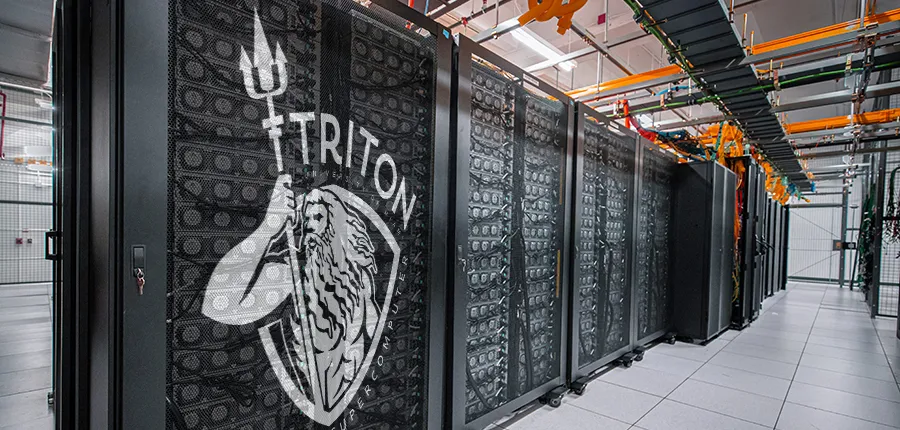

================================
User Guide to the Triton Cluster
================================

The Triton Cluster is UM's latest supercomputer, and comprises 96 IBM Power System 
AC922 servers. The Power AC922 server is designed for deep learning (DL) and 
artificial intelligence (AI), high-performance analytics and high-performance 
computing (HPC) [citation_1]. Each Power AC922 server that comprises Triton features:

- Two IBM Power 9 (TM) processors, offering up to 40 cores (2.4 GHz, 3.0 GHz turbo) cores with 256 GB of DDR4 memory.
- Two NVIDIA Tesla V100 (with NVLink 2.0) GPUs, each of which has 16 GB memory.

.. [citation_1] https://www.redbooks.ibm.com/redpapers/pdfs/redp5494.pdf

.. toctree::
   :maxdepth: 5

   Connecting <1-connecting/README>
   Software Environment Management <2-software_environment_management/README>
   Job Scheduling  <3-job_scheduling/README>
   Applications < 4-applications/README>
